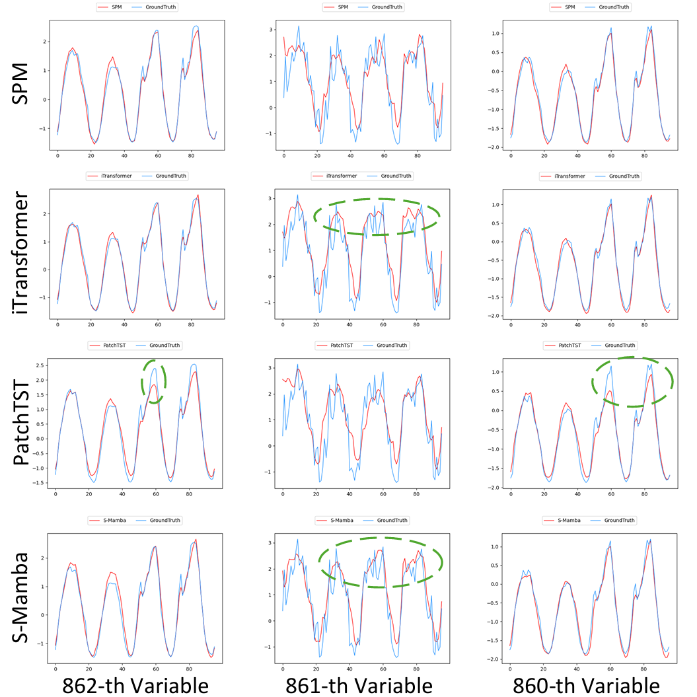

Start :

Install pip env by requirements.txt

Obtain the Weather, Exchange_rate, ILI, ETT, Traffic, and Electricity benchmarks from Google Drive 'https://drive.google.com/drive/folders/1ZOYpTUa82_jCcxIdTmyr0LXQfvaM9vIy' provided in paper 'Autoformer'; obtain the Solar benchmark from 'https://drive.google.com/drive/folders/12ffxwxVAGM_MQiYpIk9aBLQrb2xQupT-' provided in paper 'DLinear'; create a directory named 'dataset' and put them into 'dataset'

Train and test GSPM by 'bash scripts/xxx.sh'. You can directly check the main results reported in the paper by the logs in the directory named 'results on 3090GPU' or the txt named 'result.txt'. Additionally, for SPM without generalization, please replace the context of SPM_backbone.py with that of the SPM_backbone_non-generalized.py

We present a visual comparison of SPM, iTransformer, PatchTST, and S-Mamba in the figure, showing the 96-step multivariate forecasting results for the last three variables of the Traffic dataset, where the circles highlight the advantages of SPM. As shown in the prediction of the 861st variable, PatchTST fails to capture the trend with sudden rise and drop, while SPM succeeds. Further, regarding the high frequency fluctuations in the 862nd variable, all the baseline methods produce overly smooth trends, while SPM captures more fluctuations.

