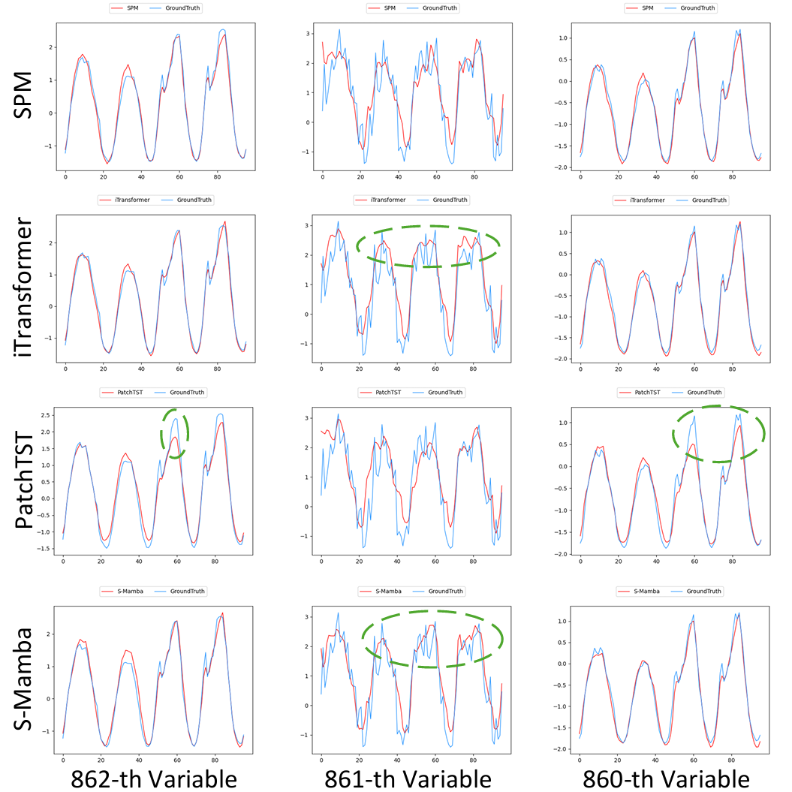

(1) Introduction:

SPM projects the input signal into Q, K, and V for auto-correlation calculation, extending it to deep learning for parameterized learning and enhanced non-linear expression ability. In the frequency domain, Q and K are first multiplied, which represents the auto-correlation calculation in the time domain. Then, the result is multiplied by V, which corresponds to the weighted integrating the auto-correlation scores with the input signal through convolution in the time domain, enabling adaptive attention to different parts of the input signal.

(2) Start :

(2.1) install pip env by requirements.txt.

(2.2) obtain the Weather, Exchange_rate, ILI, ETT, Traffic, and Electricity benchmarks from Google Drive 'https://drive.google.com/drive/folders/1ZOYpTUa82_jCcxIdTmyr0LXQfvaM9vIy' provided in paper 'Autoformer'; obtain the Solar benchmark from 'https://drive.google.com/drive/folders/12ffxwxVAGM_MQiYpIk9aBLQrb2xQupT-' provided in paper 'DLinear'; create a directory named 'dataset' and put them into 'dataset'.

(2.3) train and test by 'bash scripts/xxx.sh'. Additionally, you can directly check the main results reported in the paper in the directory named 'results on 3090GPU'.

(3) Visualization results on Traffic dataset:

we show the same prediction window T=96 for the last three variables. The green circle marks the inaccurate prediction of baselines. Among them, the green circle for 861-th variable indicates that the baselines could not predict the detailed fluctuations while SPM could. Considering the rerults across all three variables, SPM predicts more accurately than these SOTA methods overall. This demonstrates the effectiveness of SPM.

